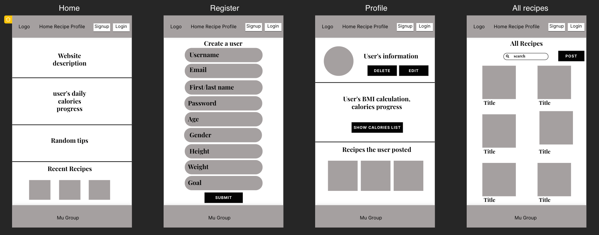
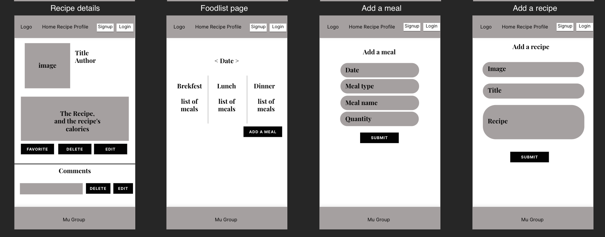
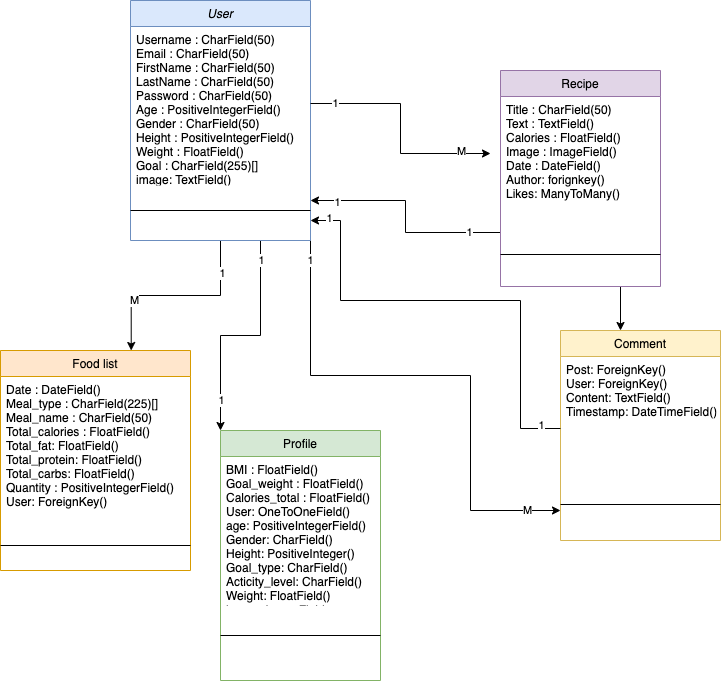

## Mu Health

### About
**Mu Health** is a health tracker. It tracks your weight and calculates a recommended daily calorie intake. It also contains a food diary for each day. As well as, a recipe blog where you can share your healthy recipe with others.

**Team Members**
* Reem Alsenan
* Abdullah Faden
* Maha Alharbi

## Application Architecture

### Wireframe


### ER diagram

### User stories 
* As a user, i want to login/register, so that i can interact with the website
* As a user, i want to add a meal, so that i can keep track of my daily meals
* As a user, i want to comment on a recipe, so that i can express my thoughts 
* As a user, i want to press the like button to a recipe, so that i can show that i like it
* As a user, i want to post a recipe, so that i can share it with other users
* As a user, i want to see my daily progress bar, so that i can keep track with my calories intake
## Demo

## General approach we took
First we drew the ER diagram to figure out the relationships between our models. Then we started working on the wireframe. After that, we divided the work between the team members.
## Instalation Instructions

```HTML
    #run the commands in this sequence
    $ code health/settings.py # Now update the 'USER' and 'PASSWORD' values in DATABASES. 
    $ pipenv shell # start workspace
    $ pipenv install #install all dependencies
    $ psql # To Connect to the database, you can use `psql -U postgres`
    `postgres=` CREATE DATABASE muhealth;# To create muhealth
    `postgres=` \q # To quit the database
    $ python manage.py createsuperuser # Creating an admin user. IF it is not work tray `$ winpty python manage.py createsuperuser`
    $ python manage.py makemigrations
    $ python manage.py migrate
    $ python manage.py runserver # start server
```

## Most difficult part of the project 
The most difficult part of the project was dealing with the API and displaying the meals based on the date.
* **API**:
We faced a problem at the beginning with finding out how to call the variables we needed. We needed the API to get the calories,protien,fat and carbs of the user's entered meals.

```JavaScript

@login_required()
def new_foodlist(request):
    form = FoodListForm()
    today = datetime.date.today()

    if (request.method == "POST"):
        foodlist = FoodListForm(request.POST)
        if (foodlist.is_valid()):
            ingr = request.POST["meal_name"]
            quant = request.POST["quantity"]
            # url = f"https://api.edamam.com/api/food-database/v2/parser?ingr={fish}&app_id=8dd6ffa9&app_key=2684fc8a5202887d5c7167103b71f982"
            url = f"https://api.edamam.com/api/nutrition-data?app_id=8dd6ffa9&app_key=2684fc8a5202887d5c7167103b71f982&ingr={quant}%20{ingr}"
            response = requests.request("GET", url)
            response_data = response.json()
        
            foodlist = foodlist.save(commit=False)
            foodlist.user = request.user
            foodlist.total_calories = response_data["calories"]
            foodlist.total_fat = response_data["totalNutrientsKCal"]["FAT_KCAL"]["quantity"]
            foodlist.total_protein = response_data["totalNutrientsKCal"]["PROCNT_KCAL"]["quantity"]
            foodlist.total_carbs = response_data["totalNutrientsKCal"]["CHOCDF_KCAL"]["quantity"]

            if (foodlist.total_calories == 0):
                messages.add_message(request , messages.SUCCESS , "There is a mistake in the name")
                return render(request , 'foodlist/foodlist_form.html' , {'form' : form})
            else:
                foodlist.save()
                messages.add_message(request , messages.SUCCESS , "A new meal has been posted")
                return redirect(f'/foodlist/{today}')
        pass

    return render(request , 'foodlist/foodlist_form.html' , {'form' : form})

```
* **Display meals based on date**:
The second problem we faced was figuring out how to display the meals in food list based on the date the user picks.

In views we added this code
```JavaScript

@login_required()
def foodlist(request  , date): 
    all_foodlist=FoodList.objects.order_by('-date')
    print(date.split('-'))
    convertdare =  datetime.date(int(date.split('-')[0]),int(date.split('-')[1]),int(date.split('-')[2]))
    yesterday =  convertdare  - timedelta(days=1) 
    tomorrow =  convertdare  + timedelta(days=1)       # all_foodlist = FoodList.objects.all().values_list()
    today_foods = []
    
    for food in all_foodlist:
        if (convertdare == food.date):
            today_foods.append(food)

    
    return render(request , 'foodlist/show_foodlist.html' , 
    'next_food':next_food ,'prev_food':prev_food ,'today'})

    {"all_foodlist" : today_foods ,
    "yesterday" : yesterday , 
    'tomorrow' : tomorrow,
    "convertdare" :convertdare
    })


```
And in the template we added this so the user can alternate between the dates.

```HTML
 <div class="dates" style="display: flex; margin:10px;     justify-content: center;">
        <button onclick="location.href =''" style="background:transparent; border:none"><</button></h1>
        <h1 style="text-align: center; margin: 10px;">{{convertdare}}</h1>
        <button onclick="location.href =''" style="background:transparent; border:none">></button>
    </div>
```
## What to add next
* Chatbox
* Calculate the calories and other nutrition values for the user when he enters a recipe
* Add different types of measurement (cup,spoon .. ect)
* Add auto complete to meals when the users enters them
* Add a username generator
* Give the user the choice to pick how fast he wants to lose weight

## Technologies 
* HTML/CSS
* JavaScript/jQuery
* Django
* Python
* Bootstrap
* Visual Studio Code
* API
* Heroku
### Packages
* Crispy-forms
* Django-environ
* Pillow
* Requests
* Django-dark
* Django-allauth

## Resources
* [Trello: used for managing the project](https://trello.com/en)
* [Figma: used for designing the Wireframe ](https://www.figma.com/)
* [Google Fonts](https://fonts.google.com/)
* [Unsplash: images](https://unsplash.com/)
* [Color palette picker](https://coolors.co/)
* [How to add dark mode to website](https://pypi.org/project/django-dark/)
* [Reset password with email](https://docs.djangoproject.com/en/3.0/topics/auth/default/#all-authentication-views)
* [EDAMAM API](https://developer.edamam.com/food-database-api)
* [Help with calculations](https://www.calculator.net/)
* [Icons](https://fontawesome.com/)
* [Illustrations](https://undraw.co/search)
* [Color palette picker](https://coolors.co/)